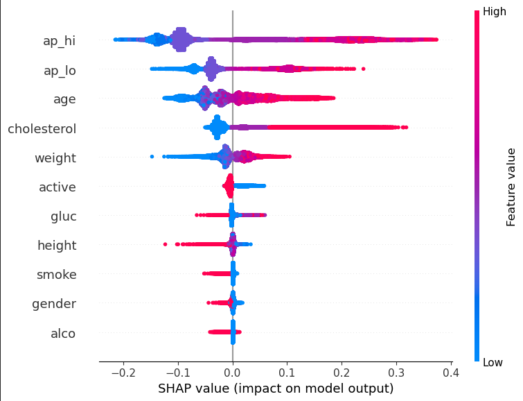

# Diagnosticando Doenças Cardíacas usando Random Forest Classifier



## Descrição

Este projeto é um exemplo de aplicação de Machine Learning para prever a presença de doenças cardíacas com base em dados demográficos e de saúde. Foi utilizado um modelo Random Forest Classifier para realizar essa previsão. O conjunto de dados inclui informações como idade, gênero, altura, peso, pressão arterial, níveis de colesterol, níveis de glicose, hábitos de fumar e beber, atividade física e a presença de doença cardíaca.

## Requisitos de Instalação

Certifique-se de ter as seguintes bibliotecas instaladas em seu ambiente:

- Python
- Jupyter Notebook
- scikit-learn (sklearn)
- seaborn
- pandas
- numpy
- matplotlib
- shap

Você pode instalar as bibliotecas usando o comando:

```shell
pip install scikit-learn seaborn pandas numpy matplotlib shap
```

## Como Usar

1. Clone o repositório:

```shell
git clone https://github.com/seu_usuario/seu_projeto.git
cd seu_projeto
```

2.Abra o Jupyter Notebook:

```shell
jupyter notebook
```

3. Abra o arquivo .ipynb e execute as células sequencialmente para ver o fluxo completo do projeto, desde a preparação dos dados até a avaliação do modelo e criação da matriz de confusão.

## Fluxo de Trabalho

1. Configuração e Análise de Dados: Carregue o conjunto de dados **'cardio_train.csv'** contendo informações sobre idade, gênero, altura, peso, pressão arterial, colesterol, glicose, hábitos de fumar, beber e atividade física.

2. Pré-processamento: Realize o pré-processamento dos dados, incluindo tratamento de valores ausentes, codificação de variáveis categóricas e divisão dos dados em conjuntos de treinamento e teste.

3.Treinamento do Modelo: Utilize o algoritmo Random Forest Classifier para treinar o modelo de previsão de doenças cardíacas.

4. Avaliação do Modelo: Avalie o desempenho do modelo utilizando métricas como precisão, recall, F1-score e a matriz de confusão.

5. Visualização de Resultados: Utilize bibliotecas como Seaborn e Matplotlib para visualizar as distribuições de características, importância de características no modelo e outros insights.

## Conclusão

Com base nos resultados da avaliação, o modelo demonstrou uma precisão de 73% na previsão de doenças cardíacas. Essa taxa de precisão, embora promissora, sugere que ainda há espaço para melhorias. É importante lembrar que a precisão do modelo pode ser afetada por diversos fatores, incluindo a qualidade e quantidade dos dados, as características selecionadas, os hiperparâmetros do modelo e a complexidade do problema.
